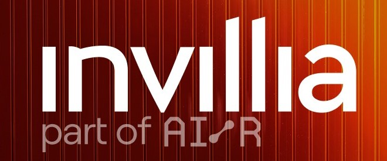

______

&nbsp;&nbsp;

&nbsp;&nbsp;
    

________

## 💻 Experiência Profissional:

- *Desenvolvedor Backend* - 09/2023 → Presente

- *Desenvolvedor Java* - 06/2022 → 09/2023

## 🎓 Formação Acadêmica:
<table style="border: none;">
    <tr>
        <td style="border: none;"></td>
        <td style="border: none;"><strong>Bacharelado em Tecnologia da Informação</strong></td>
      <td style="border: none;">2Sem/2022 → 2Sem/2025</td>
    </tr>
  <tr>
        <td style="border: none;"></td>
        <td style="border: none;"><strong>Mestrado em Química</strong></td>
        <td style="border: none;">1Sem/2020 → 2Sem/2023</td>
    </tr>
  <tr>
        <td style="border: none;"></td>
        <td style="border: none;"><strong>Graduação em Química</strong></td>
        <td style="border: none;">1Sem/2015 → 2Sem/2019</td>
    </tr>
</table>

## 🧠 Conhecimento:
| Linguagens | Marcação de Formatação | Bancos de Dados | Frameworks | Hospedagem | Ferramentas |
| --- | --- | --- | --- | --- | --- |
|   |   |   |   |   |   |

## 📜 Certificados:
</a>

## ⚙️ Repositórios de Projetos

---
